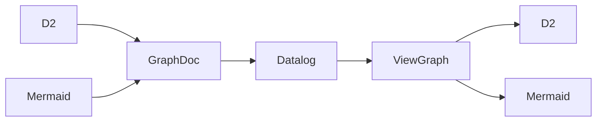

# dq

`dq` turns a D2 or Mermaid architecture document into Datalog facts, evaluates a
runtime Datalog perspective, materializes a format-neutral view, and emits D2 or
Mermaid source.

The source diagram is not the query model. D2 and Mermaid are adapters around a
small canonical property graph, so one query can be used against either input.




## Current status

This repository contains the Rust core, CLI, Python/Node/WASM FFI crates, the
Datalog contract, and universal source emitters for Mermaid and D2. Every public
surface accepts and returns only those two source formats.

The native D2 reader is a deterministic structural reader aimed at generated
architecture files. It handles nested boxes, nodes/shapes, class/SQL member
bodies, styles, metadata and edges. It does not yet implement every compiler
feature of the D2 language (imports, variables, globs, substitutions, etc.).
The frontend boundary is isolated so an official semantic adapter can replace it.

## Supported structural families

All of these normalize to the same graph/view contract:

| Family | Input normalization | Output |
| --- | --- | --- |
| Flowchart, Architecture, C4 | graph / groups / edges | universal Mermaid or D2 |
| AgentFlow | flows/groups, nodes, connectors, sequence edges | universal Mermaid or D2 |
| Class, ER, Requirement, Use Case | typed nodes/groups/relations | universal Mermaid or D2 |
| State | nodes, nesting, transitions | universal Mermaid or D2 |
| Mindmap, TreeView, Ishikawa | rooted hierarchy | universal Mermaid or D2 |
| Block | containment graph | universal Mermaid or D2 |
| Sankey | directed edges; weights remain properties/labels | universal Mermaid or D2 |
| D2 class / SQL table / general graph | graph + structured members | D2 or universal Mermaid |

Mermaid types supported by `mermaid-rs-parser` use that parser. New Mermaid 12
TreeView, Ishikawa, AgentFlow and Use Case syntax has small graph-semantic fallback
adapters so the core does not wait on parser support.

## Build

```bash
./scripts/bootstrap.sh
```

Or, if Rust is already installed:

```bash
cargo build -p dq --release
cargo test -p dq-core
```

## Test

```bash
cargo test --workspace
cargo test -p dq --test e2e
```

`tests/cli_fixtures.rs` owns the CLI snapshot tests and is included by
`crates/dq-cli/tests/e2e.rs`, because the workspace root has no package target.
`tests/assets/source` holds complex and adversarial D2/Mermaid inputs;
`tests/assets/perspectives` holds their Datalog views; and
`tests/assets/expect` contains the exact generated D2 or Mermaid source for
each perspective. The suite covers nested containment, quoted and escaped
labels, edge operators, structured members, style/native precedence, malformed
sources, invalid materialized views, and removed rendering/JSON options.

`tests/external_validators.rs` independently compiles every valid `.d2` source
fixture and generated D2 snapshot with the official `d2` CLI, and parses every
valid Mermaid fixture and snapshot with `merman-cli`. Each validator test skips
only when its executable is absent from `PATH`; set `DQ_D2` or
`DQ_MERMAN_CLI` to an explicit executable path in CI or a nonstandard shell.

## CLI

```bash
# D2 -> D2
./target/release/dq architecture.d2 -q perspective.dl

# D2 -> Mermaid
./target/release/dq architecture.d2 -q perspective.dl --emit mermaid

# Mermaid -> D2
./target/release/dq architecture.mmd -q perspective.dl --emit d2

# stdin
cat architecture.d2 | ./target/release/dq -q perspective.dl --input-format d2


Example:

```bash
./target/release/dq examples/architecture.d2 -q examples/all.dl --emit mermaid
./target/release/dq examples/architecture.mmd -q examples/all.dl --emit d2
```

## Datalog input facts

```prolog
document(SourceFormat, Family).
document_direction(Direction).
node(Id, Kind, Label, Shape).
edge(Id, Kind, From, To, Label, Directed).
group(Id, Label).
contains(Group, ItemKind, ItemId).
prop(TargetKind, Id, Key, Value).
member(Owner, Position, Name, Type).
note(Id, TargetKind, TargetId, Text, Position).
document_prop(Key, Value).
```

All values except integer positions and booleans are strings.

Quoted Datalog strings accept JSON escapes, including `\"`, `\\`, and `\n`, on
native and WebAssembly builds.

## Datalog output contract

A perspective is defined by deriving reserved `view_*` predicates:

```prolog
view_node(Instance, Entity).
view_new_node(Instance, Kind, Label, Shape).

view_group(Instance, Label).
view_contains(Group, ItemKind, ItemInstance, Priority).

view_edge(Instance, Relation, FromInstance, ToInstance).
view_new_edge(Instance, FromInstance, ToInstance, Kind, Label).

view_style(TargetKind, TargetId, Key, Value, Priority).
view_note(NoteId, TargetKind, TargetId, Text, Position, Priority).
view_option(Key, Value, Priority).

view_native(Format, TargetKind, TargetId, Key, Value, Priority).
```

`view_node` separates a semantic entity from a visual instance, so a perspective
can intentionally draw the same entity more than once.

Styles and containment are deterministic: the highest priority wins. Conflicting
values at the same priority are errors. Containment cycles and dangling edge/note
targets are errors.

Portable style keys currently include:

```text
fill
stroke
font_color
color
stroke_width
stroke_dash
stroke_dasharray
```

`stroke_dasharray` is an alias of `stroke_dash`; both share one priority winner.
Source spellings such as `font-color`, `stroke-width`, and `stroke-dash` are
normalized to the same portable keys before perspective styles are applied.

Output-format-specific attributes use `view_native`. For example:

```prolog
view_native("d2", "node", "api", "near", "top-center", 500).
view_native("d2", "edge", "calls", "style.stroke-dash", "5", 500).
```

For a key shared with a portable style or D2 attribute, a `view_native` value
takes precedence. This emits one unambiguous output property rather than
duplicating keys in generated source.

## Example query

```prolog
view_node(N, N) :- node(N, K, L, S).
view_group(G, L) :- group(G, L).
view_contains(G, K, I, 10) :- contains(G, K, I).
view_edge(E, E, A, B) :- edge(E, K, A, B, L, D), view_node(A, A), view_node(B, B).

view_style("node", N, "stroke", "#334155", 20) :- view_node(N, E).
view_style("group", G, "stroke", "#94a3b8", 20) :- view_group(G, L).
view_style("edge", E, "stroke", "#64748b", 20) :- view_edge(E, R, A, B).
view_option("direction", "LR", 100).
```

## FFI layout

The workspace includes:

```text
crates/dq-core    canonical IR + Datalog + adapters + emitters
crates/dq-cli     dq executable
crates/dq-python  PyO3 cdylib
crates/dq-node    napi-rs cdylib used by Node and Bun
crates/dq-wasm    wasm-bindgen library (D2/Mermaid source output)
bindings/bun      Bun package loader and TypeScript declarations
```

Build raw Python/Node/WASM artifacts with:

```bash
./scripts/build-ffi.sh
```

Run real host-runtime smoke tests for every binding surface:

```bash
./scripts/test-node-ffi.sh
./scripts/test-python-ffi.sh
./scripts/test-wasm-ffi.sh
./scripts/test-bun-ffi.sh
```

The Node, Python, and Bun scripts build their cdylibs, stage them under the
Cargo target directory, and load them through the actual host runtime. The
WASM script builds `wasm32-unknown-unknown`, generates a Node adapter with
`wasm-bindgen`, then runs the same fixture contract.

Build a Bun-loadable package without running its smoke test with:

```bash
./scripts/build-bun-ffi.sh
DQ_BUN_PACKAGE="$PWD/target/bun" bun tests/bun_ffi.cjs
```

`dq.node` is host-native. Build/package it separately for every Bun
OS/architecture you distribute.

```js
const dq = require("./target/bun");
const output = dq.transform(source, query, "d2", "mermaid");
```

The Bun target deliberately reuses `dq-node` rather than duplicating a Rust
ABI: Bun supports loading Node-API `.node` modules directly.

The durable boundary is `dq_core::Document`: parse once, run many perspectives.
That is the path to use for long-lived Python/Node/browser hosts once their class
wrappers are expanded beyond the one-shot `transform()` function.

