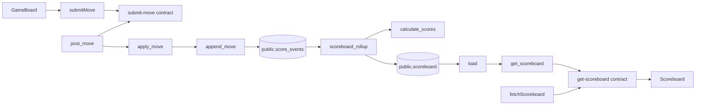

# Polyglot snake architecture indexing

This is a self-contained reference example for a future architecture collector.
It does **not** add an indexer to `dq-core`, change `dq` input semantics, add a
rendering backend, or claim that the committed graph artifacts were collected
from this repository. The example shows the data model, source conventions, and
mechanical workflow a collector would use; `dq` is used only after the assembled
D2 graph exists.

```mermaid
flowchart LR
    Source[TypeScript, Rust, Python, OpenAPI, PostgreSQL DDL] --> SCIP[Per-language SCIP indexes]
    SCIP --> Context[Syntax and framework classification]
    Source --> Annotations[@arch source annotations]
    Source --> Contracts[OpenAPI and DDL extraction]
    Config[architecture.toml] --> Normalize[Normalization and ownership]
    Context --> Facts[Raw facts]
    Annotations --> Facts
    Contracts --> Facts
    Normalize --> Facts
    Facts --> Graph[Canonical architecture graph]
    Graph --> D2[Assembled D2]
    D2 --> DQ[dq perspective]
    DQ --> Mermaid[Mermaid or D2 source]
```

## What this models

The system has a React client, an Axum game API, a Dagster score rollup, and a
PostgreSQL database. Stable cross-language joints are deliberately explicit:

| Kind | Stable ID |
| --- | --- |
| Component | `component://web-client` |
| Component | `component://game-server` |
| Component | `component://scoreboard-analysis` |
| Component | `component://snake-postgres` |
| Service | `service://game-api` |
| HTTP contract | `contract://http/game-api/submit-move` |
| HTTP contract | `contract://http/game-api/get-scoreboard` |
| PostgreSQL data resource | `data://postgres/snake/public/score_events` |
| PostgreSQL data resource | `data://postgres/snake/public/scoreboard` |
| Optional runtime | `runtime://dagster/snake` |

Code symbols use stable, line-number-free illustrative IDs:

```text
code://snake/{project}/{path}#{symbol}
```

For example, `code://snake/server/src/game.rs#GameService.apply_move` remains
stable when the method moves within its source file. A production normalizer
would derive those IDs from language-specific SCIP symbols plus the project
mapping in `architecture.toml`.



The arrows through HTTP contracts and PostgreSQL resources are intentional.
There is no guessed `submitMove -> post_move` or `scoreboard_rollup -> load`
function edge: those functions live in different language universes and their
runtime relationship is established by an OpenAPI operation or a data resource,
not a matching name or a heuristic.

## Layout

```text
.
├── architecture.toml                 # ownership, normalization, aliases, rare assertions
├── contracts/game-api.openapi.yaml   # HTTP operation IDs
├── db/migrations/0001_scores.sql     # table IDs
├── apps/web/                          # React / TypeScript client
├── services/game-server/              # standalone Axum crate ([workspace] opts out of dq)
├── pipelines/scoreboard/              # Dagster / psycopg package
├── scripts/
│   ├── index-scip.sh                  # emits binary indexes and inspection snapshots
│   ├── validate_artifacts.py          # stdlib validation used by verify.sh
│   └── verify.sh                      # language, artifact, dq, optional external checks
├── perspectives/                      # dq Datalog views
└── expected/                          # committed representative artifacts
```

`.gitignore` excludes `.architecture/`, dependency directories, compiled
outputs, virtual environments, bytecode, and binary `*.scip` indexes. It does
not exclude `expected/`.

## Sources and annotations

`@arch` is intentionally small and language-independent. Every directive is a
single physical line and attaches to the nearest enclosing declaration. It
records architecture facts that a static index cannot safely infer.

```ts
/** @arch edge kind="consumes" to="contract://http/game-api/submit-move" */
export async function submitMove(/* ... */) {}
```

```rust
/// @arch edge kind="provides" to="contract://http/game-api/submit-move"
pub async fn post_move(/* ... */) {}
```

```python
@asset
def scoreboard_rollup():
    """
    @arch edge kind="reads" to="data://postgres/snake/public/score_events"
    @arch edge kind="writes" to="data://postgres/snake/public/scoreboard"
    """
```

```sql
-- @arch node id="data://postgres/snake/public/score_events" kind="postgres.table" label="public.score_events"
CREATE TABLE public.score_events (...);
```

Allowed directive forms are `edge`, `node`, and `property`. They contain no
colors, D2 shapes, Mermaid syntax, visual group assignments, or layout
information. Perspectives own presentation.

`apps/web/src/api.ts` maps `VITE_API_BASE` requests to the two OpenAPI operation
IDs. `services/game-server/src/http.rs` provides those operations. The Rust
repositories and Python asset annotate database access. The source remains
small enough for each local relationship to be visible without implementing an
architecture collector.

## What SCIP does and does not establish

Each language indexer emits a binary SCIP Protobuf index. It can provide
language-local definitions, references, symbols, source ranges, and—when the
indexer emits them—implementation or relationship data. That is enough evidence
to find a reference to `submitMove` in `GameBoard`, but not enough to conclude
that every reference is a call.

A collector therefore combines SCIP with language syntax and framework context:

- a TypeScript reference inside a call expression becomes a local `calls` edge;
- a Rust method invocation becomes a local `calls` edge;
- a Python call expression becomes a local `calls` edge;
- an Axum route declaration and a `fetch` URL can be normalized against OpenAPI;
- explicit SQL strings can be parsed and normalized against DDL resources.

SCIP alone does **not** provide HTTP client-to-server matching, database
producer/consumer matching, component ownership, dynamic configuration links,
or architecture-specific meaning for arbitrary references. Those facts come
from annotations, OpenAPI, DDL, `architecture.toml`, and future
syntax/framework extractors.

Expected local call chains are:

```text
GameBoard -> submitMove
Scoreboard -> fetchScoreboard
post_move -> GameService::apply_move -> ScoreEventRepository::append_move
get_scoreboard -> ScoreboardRepository::load
scoreboard_rollup -> calculate_scores
```

The complete cross-language route is:

```text
GameBoard
  -> submitMove
  -> submit-move contract
  <- post_move
  -> GameService::apply_move
  -> append_move
  -> score_events
  <- scoreboard_rollup
  -> scoreboard
  <- ScoreboardRepository::load
  <- get_scoreboard
  -> get-scoreboard contract
  <- fetchScoreboard
  <- Scoreboard
```

Arrow direction in that prose describes traversal through the stable joints;
`expected/architecture.graph.json` records provider/consumer edges in their
actual source-to-resource direction.

## `architecture.toml`

The configuration is an input to a future normalizer. It supplies:

- workspace metadata and `.architecture/` output locations;
- annotation attachment rules;
- three language roots (`web`, `server`, and `scoreboard`);
- project-to-component ownership;
- the four component declarations and `service://game-api`;
- OpenAPI and PostgreSQL DDL sources;
- HTTP base URL/path and SQL schema normalization;
- stable code-ID format with line numbers explicitly disabled;
- local `VITE_API_BASE` and `DATABASE_URL` mappings;
- HTTP and database aliases;
- one rare manual fact: the scoreboard component runs on
  `runtime://dagster/snake`.

It deliberately contains no ordinary code calls. A copied call list would be
stale and would defeat the purpose of SCIP plus syntax classification.

## Committed representative artifacts

There is no generalized collector in this repository. The following files are
**manually curated representative examples** of its intended outputs:

| Artifact | Meaning | Provenance status |
| --- | --- | --- |
| `expected/raw-facts.jsonl` | append-friendly input records with evidence | representative, manually curated |
| `expected/architecture.graph.json` | merged canonical node/edge graph | representative, manually curated |
| `expected/architecture.d2` | assembled D2 graph accepted by `dq` | representative, manually curated |
| `expected/component-overview.mmd` | `dq` component perspective | generated from committed D2 and perspective |
| `expected/code-and-data-flow.mmd` | `dq` code/data perspective | generated from committed D2 and perspective |

The raw-fact provenance fields distinguish:

| Fact source | Confidence | Example |
| --- | --- | --- |
| SCIP | `index` | source symbol and range |
| SCIP plus syntax context | `derived` | local `calls` edge |
| `@arch` | `asserted` | consumes, provides, reads, writes |
| OpenAPI | `derived` | stable HTTP operation node |
| DDL annotation | `asserted` | stable PostgreSQL resource node |
| `architecture.toml` | `asserted` | ownership, aliases, Dagster runtime |
| committed expected output | `representative-manually-curated` | future collector target shape |

The Mermaid files are the sole snapshot artifacts that are mechanically
regenerated today. Do not edit them by hand; rerun the corresponding `dq`
command below after changing the D2 input or Datalog view.

## Run it

### Language checks

```bash
cd examples/polyglot-snake

# TypeScript; npm ci creates only ignored node_modules/.
(cd apps/web && npm ci && npm run typecheck)

# Independent from the parent Cargo workspace.
(cd services/game-server && cargo check)

# Keep the environment outside the example.
python3 -m venv /tmp/polyglot-snake-venv
/tmp/polyglot-snake-venv/bin/python -m pip install pipelines/scoreboard
/tmp/polyglot-snake-venv/bin/python -c 'from snake_scoreboard import defs; print(defs)'
```

`verify.sh` performs equivalent checks in a temporary directory, validates the
TOML/JSON/JSONL artifacts, reproduces the two Mermaid snapshots, and invokes
external D2/Mermaid validators only when installed:

```bash
cd examples/polyglot-snake
./scripts/verify.sh

# Optional nonstandard validator paths.
DQ_D2=/path/to/d2 DQ_MERMAN_CLI=/path/to/merman-cli ./scripts/verify.sh
```

The verifier requires Python 3.11+ for the standard-library `tomllib` parser.
The example package itself declares Python 3.10+.

The checked run used Python 3.14.2, `d2 v0.9.0`, and
`merman-cli 0.8.0-alpha.6`.

### SCIP indexing and inspection snapshots

Install the indexers and the SCIP CLI:

```bash
npm install --global @sourcegraph/scip-typescript @sourcegraph/scip-python
# Install scip from https://github.com/scip-code/scip/releases,
# or build the official repository's ./cmd/scip.
# Install a rust-analyzer binary that exposes `rust-analyzer scip`.
```

Then run:

```bash
cd examples/polyglot-snake
./scripts/index-scip.sh
```

The script emits these non-committed binary Protobuf files:

```text
.architecture/scip/web.scip
.architecture/scip/server.scip
.architecture/scip/scoreboard.scip
```

It runs `scip lint`, `scip stats`, and `scip snapshot` for each index. The
snapshots under `.architecture/snapshots/` are the human-readable inspection
mechanism; binary `.scip` files are not committed. A lint failure is retained as
`<name>.lint.log` beside its snapshot and reported as a warning so current
indexer metadata gaps do not suppress the useful index and inspection output.
The script fails early with specific installation guidance for each missing
command and is safe to rerun: it deletes only its own `.architecture/scip` and
`.architecture/snapshots` directories.

Command surfaces were verified against `scip-typescript 0.4.0` and
`scip-python 0.6.6` using their current `index --help` output, and against the
installed `rust-analyzer 0.0.0 (7cb789d982 2026-02-01)`, which accepts:

```text
scip-typescript index --cwd <project> --output <index.scip> --no-progress-bar
rust-analyzer scip <project> --output <index.scip>
scip-python index --cwd <project> --project-name <name> --output <index.scip>
scip lint <index.scip>
scip stats --from <index.scip> --project-root <project>
scip snapshot --from <index.scip> --to <directory> --strict=false
```

The upstream TypeScript indexer currently documents Node 22 and 24 as its
supported releases. `scip-python` documents Python 3.10+ and Node 16+.
The checked run used Node 25.6.0: indexing completed, but that is outside the
TypeScript indexer's documented support range. `index-scip.sh` does not conceal
a version mismatch: it executes the installed command and reports its version.

The real run used `scip v0.10.0`. It exposed two compatibility observations,
which the script records rather than hiding:

- `scip lint` reports missing external `SymbolInformation` for all three
  Sourcegraph language-indexer outputs, including TypeScript standard-library
  symbols. The index files and `scip snapshot --strict=false` still complete;
  the per-index lint logs preserve the exact diagnostics.
- This installed rust-analyzer invokes `cargo metadata --lockfile-path`, while
  the checked `cargo 1.99.0-nightly (7c83d4cc0 2026-07-29)` rejects that flag.
  rust-analyzer warns, falls back, and emits `server.scip`; upgrade either tool
  when a fully dependency-resolved Rust index is required.

### dq perspectives

From this directory:

```bash
cargo run --quiet --manifest-path ../../Cargo.toml -p dq -- \
  expected/architecture.d2 \
  --query perspectives/component-overview.dl \
  --emit mermaid > expected/component-overview.mmd

cargo run --quiet --manifest-path ../../Cargo.toml -p dq -- \
  expected/architecture.d2 \
  --query perspectives/code-and-data-flow.dl \
  --emit mermaid > expected/code-and-data-flow.mmd
```

`component-overview.dl` retains only components, HTTP contracts, PostgreSQL
resources, and their cross-component relationship edges. `code-and-data-flow.dl`
retains selected code symbols, local calls, contracts, data resources, and
cross-language data flow. Both use portable `dq` styles: blue TypeScript,
orange Rust, green Python, purple contracts, slate database resources, dark
call edges, and dashed teal contract/data edges.

## Deliberate limitations and extension points

This is not a production architecture collector. It deliberately leaves these
pieces outside the task:

- collecting `@arch` directives from source;
- ingesting SCIP Protobuf into the raw-fact model;
- tree-sitter-based call-context classification;
- Axum route extraction and `fetch` URL extraction;
- SQL parser integration and OpenAPI route matching;
- cross-repository source resolution;
- dynamic configuration discovery;
- incremental caching and invalidation;
- replacing the representative expected artifacts with generated ones;
- rendering diagrams beyond `dq`'s existing D2/Mermaid source output.

Those boundaries keep the example honest: it demonstrates how the pieces join
without pretending that a small sample has implemented the collector.
